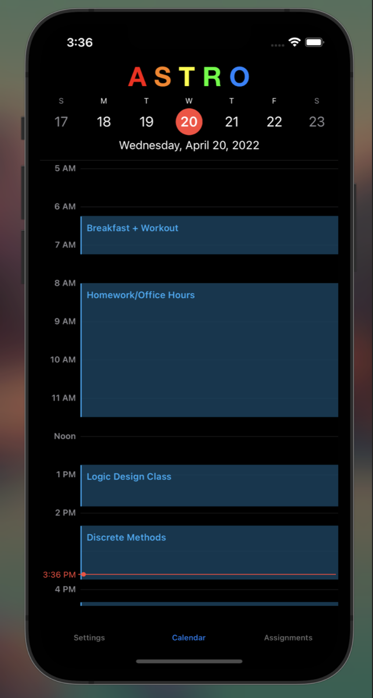
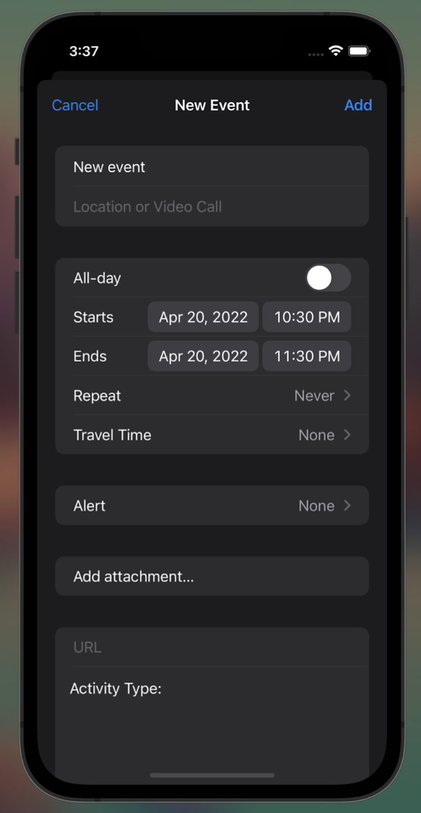

# Astro

## Overview

This Application is a Swift-based Calendar which will in the future have Astro has an Accountability Buddy where he will keep you on track with your day using Human Activity Recognition

## Screens

</a>

</a>

 

## Running our Application:

1. Open Xcode
2. Clone Repository
3. Connect Iphone to computer
4. Press Play button in Xcode!

## Team

| Role               | Team Member                                  |
| ------------------ | -------------------------------------------- |
| Software Developer | [Parker Bath](https://github.com/parkerbath) |

## Product Justification

The inspiration from this project came from the struggles of transitioning into becoming an adult and trying to find a way for technology to (for once) help you stay motivated and keep yourself accountable to what you want to achieve

## Product, Technical, and Design Documentation

| Tech Stack | Technology |
| ---------- | ---------- |
| Front-End  | Swift      |
| Back-End   | Firebase   |

## Product Scope

By the end of the semester, I intended to produce:

- Front-End Calendar that the User can use to plan out their days
- Calibration Page
- Accountability Messages from Astro himself

Sadly I was only able to produce the Calendar to be fully functional but I intend on working on the other portions over this summer to have a fully rounded working application

To see previous machine learning work I have done, go to:
https://github.com/parkerbath/Astro_fall
